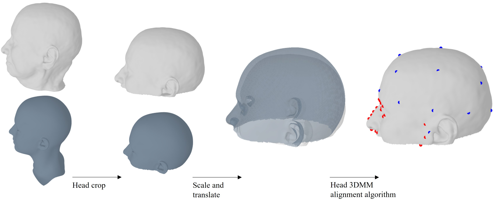
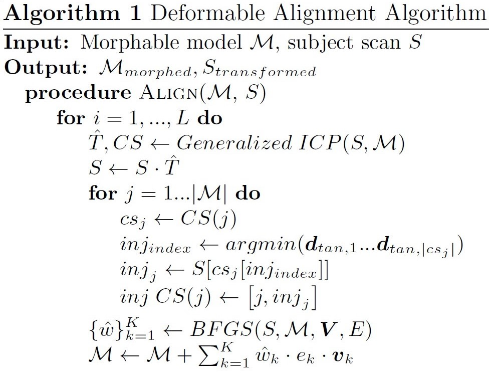
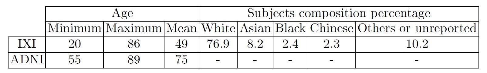
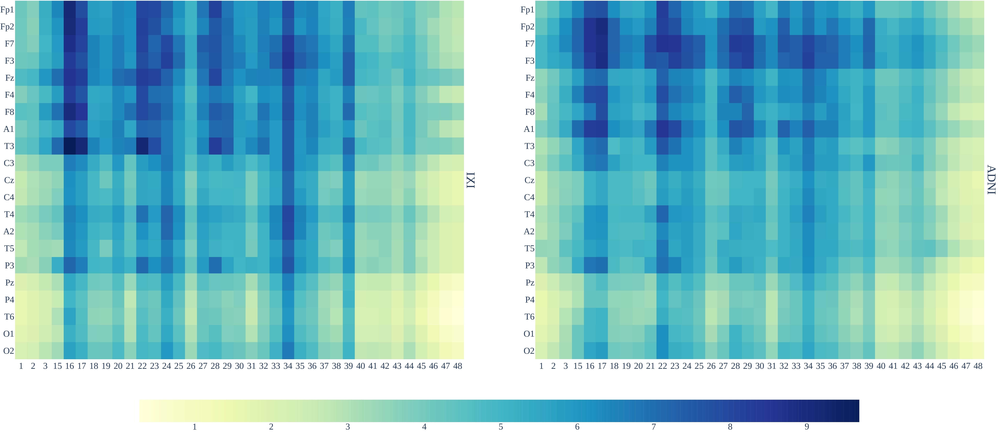
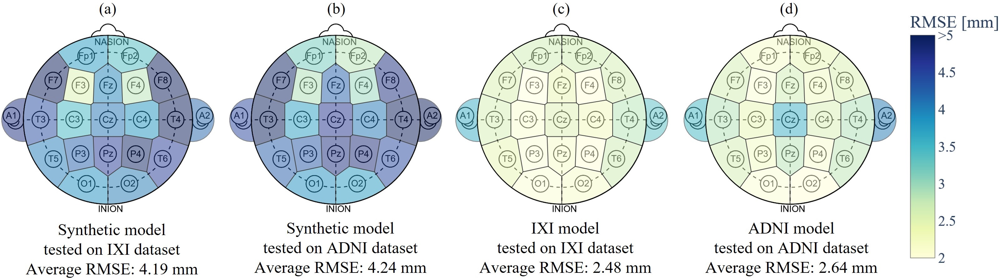
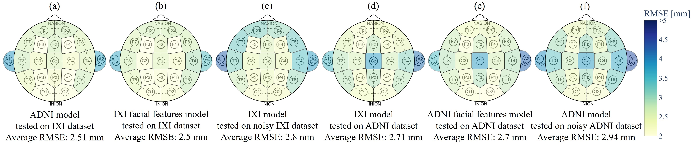

# ANLD
"Automatic Neurocranial Landmarks Detection From Visible Facial Landmarks Leveraging 3D Head Priors" code repository for [12th MICCAI CLIP Workshop](https://miccai-clip.org/).
 
## Table of Contents
- `Chamfer distance analysis` - Computing and analyzing Chamfer distances between MRI reconstructed meshes and aligned point clouds, and evaluating results over the entire head and over the face 
- `Deformable alignment` - Deform and align the 3DMM template to fit it to the input head point clouds and extract relevant details
- `Images` - Repository images
- `Neurocranial features prediction` - Model training and predicting neurocranial features 
- `Utils` - MRI meshing and Mutual information analysis

## Abstract
The localization and tracking of neurocranial landmarks is essential in modern medical procedures, e.g., transcranial magnetic stimulation (TMS). However, state-of-the-art treatments still rely on the manual identification of head targets and require setting retroreflective markers for tracking. This limits the applicability and scalability of TMS approaches, making them time-consuming, dependent on expensive hardware, and prone to errors when retroreflective markers drift from their initial position. To overcome these limitations, we propose a scalable method capable of inferring the position of points of interest on the scalp, e.g., the International 10-20 System's neurocranial landmarks. In contrast with existing approaches, our method does not require human intervention or markers; head landmarks are estimated leveraging visible facial landmarks, optional head size measurements, and statistical head model priors. We validate the proposed approach on ground truth data from 1,150 subjects, for which facial 3D and head information is available; our technique achieves a localization RMSE of 2.56 mm on average, which is of the same order as reported by high-end techniques in TMS.

## Datasets and Preprocessing
Note: the implementation of the work described in the associated paper and in this repository relies on the user downloading the [IXI](https://brain-development.org/ixi-dataset/) and [ADNI](https://adni.loni.usc.edu/) datasets, and the use of a 3DMM model (such as the UHM by [Ploumpis et al.](https://github.com/steliosploumpis/Universal_Head_3DMM)).
 
 
Different stages of the subject's head (light gray) landmark annotation process using the head 3DMM (slate gray).

    

When both meshes are aligned, we use the 3DMM landmark annotations to annotate the subject's head mesh. Using facial landmarks (red points) and cranial size features we infer cranial landmarks (blue points) coordinates.
 
 
The Deformable Alignment Algorithm which was used during the preprocessing alignment stage to morph the 3DMM to match the subject's aligned head point cloud.

    

The algorithm runs a process iteratively for L iterations at most, we empirically found that L=3 is sufficient.
 
It utilizes Generalized ICP to establish a correspondence set between points in both point clouds and find the optimal transformation matrix between them. Then, runs both meshes are aligned after the algorithm runs, and we use the 3DMM landmark annotations to annotate the subject's head mesh.
 
Using facial landmarks and cranial size features we infer cranial landmarks coordinates.
 
 
Detailed MRI datasets subjects composition and age statistics.
 
IXI dataset was collected from healthy subjects.
 
ADNI dataset was collected from memory and cognitive impaired subjects along normal aging subjects with no signs of cognitive impairment, depression, or dementia. ADNI dataset exact subjects' ethnicity composition is not publicly reported.

    

## Experimental results
Mutual information between facial and neurocranial landmark coordinates in both MRI datasets.

    

The mutual information values between landmarks range between 0.28 to 9.68.
 
Mutual information share similar patterns and values across both MRI datasets, which reinforces the validity of these relationships as captured by our annotation method.
 
 
Displacement RMSE across 10-20 System landmarks predicted from facial landmarks and three geodesic distances measured across subjects' head surface MRI reconstruction.

    

(a) Synthetic model tested with IXI.
 
(b) Synthetic model tested with ADNI.
 
(c) IXI model tested with IXI.
 
(d) ADNI model tested with ADNI.
 
 
Ablation study results. Illustrated scalps represent the displacement RMSE across 10-20 System landmarks, when predicted with the following conditions.

    

(a) ADNI model tested on IXI.
 
(b) IXI model (trained with facial features only) tested on IXI.
 
(c) IXI model tested on noisy IXI.
 
(d) IXI model tested on ADNI.
 
(e) ADNI model (trained with facial features only) tested on ADNI.
 
(f) ADNI model tested on noisy ADNI.
 
MRI models (a, d) show good results also when tested on the other MRI dataset. Missing cranial size measurements (b, e) slightly degrade prediction results. Noisy features acquisition (c, f) demonstrates robustness in the MRI models.